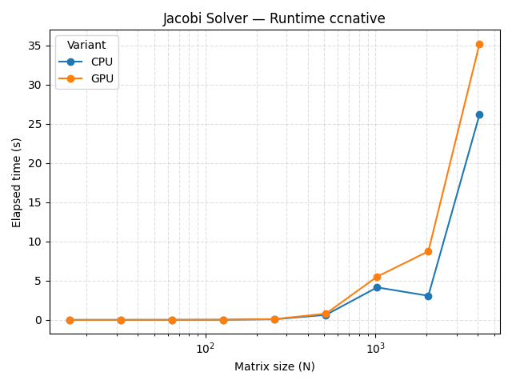
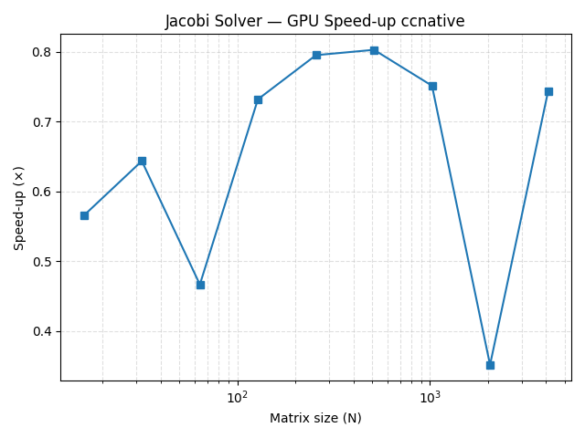
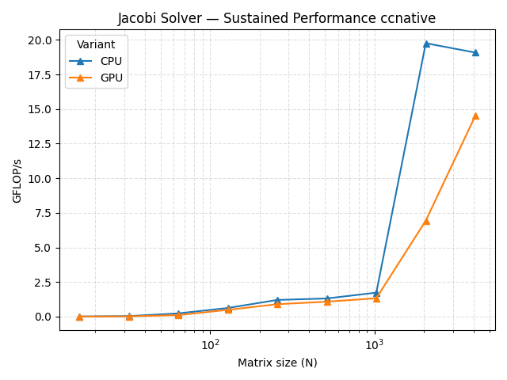
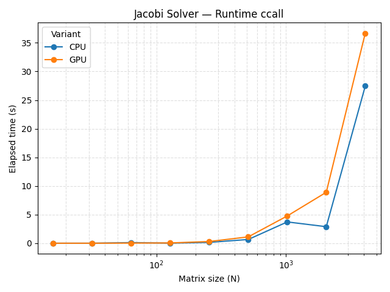
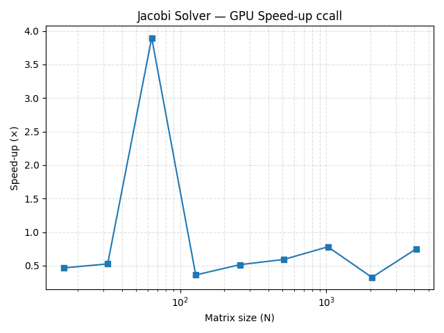
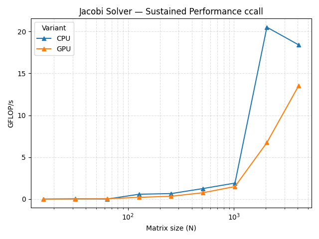

# Jacobi Solver

## What I coded
| File | Role | Build command |
|------|------|---------------|
| **`jacobi_serial.cpp`** | CPU Jacobi solver using OpenMP *multicore*. Two `parallel for` loops: one for the sweep, one reduction for the convergence norm. | `nvc++ -std=c++20 -O3 -mp=multicore jacobi_serial.cpp -o jacobi_cpu` |
| **`jacobi_gpu.cpp`** | Same kernel off-loaded to the GPU with OpenMP `target teams distribute parallel for`. A surrounding `target data` keeps the big vectors resident on the device. | `nvc++ -std=c++20 -O3 -mp=gpu -gpu=ccnative jacobi_gpu.cpp -o jacobi_gpu` |
| **`benchmark_jacobi.sh`** | Builds both binaries, runs a size sweep, grabs *time* & *iteration* counts, writes **`jacobi_bench.csv`**. |

### OpenMP
* **CPU path** – plain `parallel for` + `reduction`.
* **GPU path** – loops wrapped in `target` regions inside a persistent `target data` block → zero PCIe traffic during iterations.
* Branch removed with `sigma += aij * xold[j] * (i != j);` to dodge divergence.

---

## Results

### Build with `-gpu=ccnative`

| Runtime | Speed-up | GFLOP/s |
|---------|----------|---------|
|  |  |  |

*GPU never quite beats the CPU for this dense kernel; both top out at ~15–20 GF/s once **N** > 2000.*

### Build with `-gpu=ccall`

| Runtime | Speed-up | GFLOP/s |
|---------|----------|---------|
|  |  |  |

*Old back-end shows the same story—GPU hovers around 0.7–0.8 × speed-up.*
